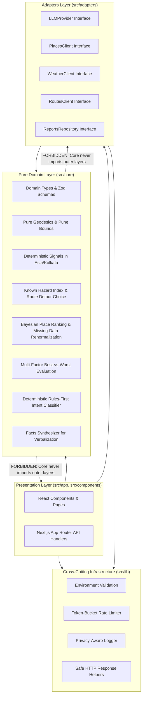

# Puneri Safar &mdash; Architecture Guide

This document describes the architectural principles, layering hierarchy, and dependency rules governing the Puneri Safar codebase.

---

## 1. Architectural Philosophy: Ports & Adapters (Hexagonal Architecture)

Puneri Safar decouples core business logic (risk calculations, place ranking, user context modeling) from external infrastructure (Google Maps, Gemini API, Firestore, Next.js App Router).

---

## 2. Layering Rules & Dependency Constraints

### Rule 1: `src/core/` is PURE

- **Zero Framework Imports**: No React, Next.js, Node.js filesystem (`fs`), or vendor SDKs.
- **Zero I/O or Network**: No `fetch`, `axios`, databases, or network sockets.
- **Deterministic**: Pure functions only. Given identical input, produces identical output.
- **Strict Isolation**: `core/` must **NEVER** import from `src/adapters/` or `src/app/`.

### Rule 2: `src/adapters/` abstracts all External I/O

- Every third-party service (Google Gemini, Groq, Google Places API, Google Routes API, OpenWeather, Firebase Firestore) is placed behind a strict TypeScript interface contract.
- Adapters can be mocked offline (`tests/mocks/`) allowing 100% of the platform to be tested without active API keys or internet access.
- Adapters may import domain models from `src/core/` and utility tools from `src/lib/`, but must **NEVER** import from `src/app/`.

### Rule 3: `src/app/` is Thin Orchestration

- Next.js App Router handles HTTP routing, request deserialization, security headers, and rate limiting.
- Route handlers must not contain core business algorithms; they orchestrate calls to `core/` and `adapters/`.

### Rule 4: `src/lib/` is Cross-Cutting Infrastructure

- Provides shared building blocks (Zod environment validation, structured logger with coordinate & secret redaction, safe HTTP error responses, token-bucket rate limiter).

---

## 3. Directory Taxonomy

| Directory       | Role                                     | Allowed Inward Imports                                      | Forbidden Inward Imports                                    |
| --------------- | ---------------------------------------- | ----------------------------------------------------------- | ----------------------------------------------------------- |
| `src/core/`     | Domain logic & algorithms                | None (Standard JS math/types only)                          | `src/app/`, `src/adapters/`, `src/lib/` (network/framework) |
| `src/adapters/` | External service contracts               | `src/core/`, `src/lib/`                                     | `src/app/`                                                  |
| `src/app/`      | Routing & API endpoints                  | `src/core/`, `src/adapters/`, `src/lib/`, `src/components/` | None                                                        |
| `src/lib/`      | Infrastructure utilities                 | Standard packages (`zod`, etc.)                             | `src/app/`, `src/adapters/`                                 |
| `src/data/`     | Static municipal datasets & JSON Schemas | None (Static assets)                                        | Source code                                                 |
| `tests/mocks/`  | In-memory adapter test doubles           | `src/adapters/`, `src/core/`                                | Production secrets                                          |

---

## 4. Security & Privacy by Architecture

- **Secret Isolation**: Server secrets are strictly separated from client code in `src/lib/env.ts`. Any attempt to access server keys in browser contexts throws a runtime exception.
- **GPS Privacy**: The logger (`src/lib/logger.ts`) sanitizes coordinates matching GPS patterns, preventing leakage of raw user locations in log aggregators.
- **Fail-Safe HTTP Responses**: Internal stack traces and database errors are scrubbed in `src/lib/http.ts`, returning sanitized error codes to API consumers.
